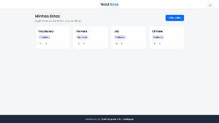
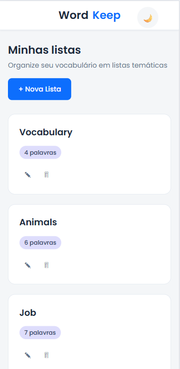
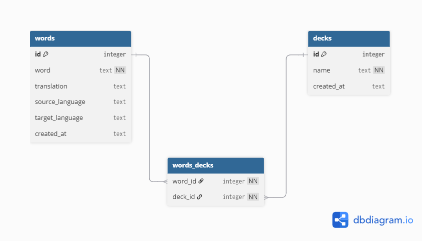
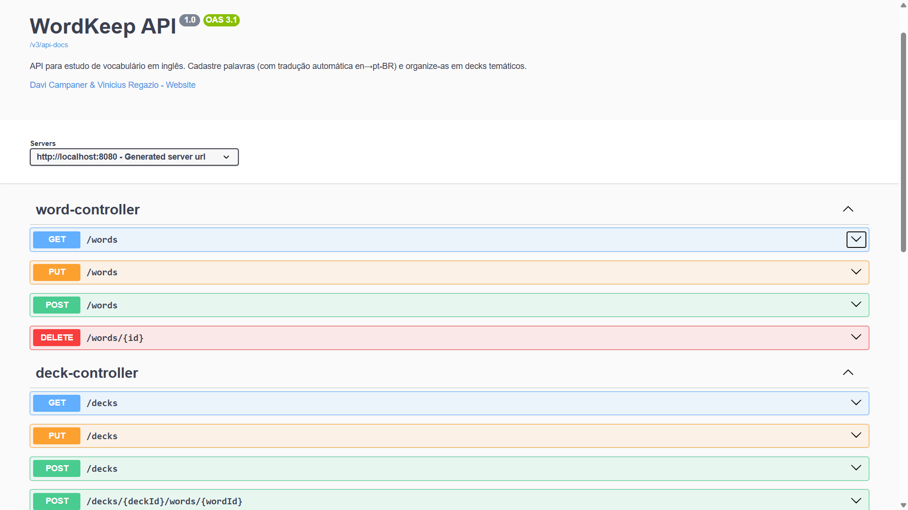

# WordKeep

<p align="center">
  
  
  
  
  
</p>

> Aplicação web para estudo de vocabulário em inglês. Cadastre palavras, organize-as em listas temáticas, estude com flashcards e revise quando quiser — com tradução automática integrada via [MyMemory API](https://mymemory.translated.net/).

---

## Pré-visualização

<p align="center">
  
</p>

<p align="center">
  
</p>

---

## Sumário

- [Pré-visualização](#pré-visualização)
- [Funcionalidades](#funcionalidades)
- [Tecnologias](#tecnologias)
- [Estrutura do projeto](#estrutura-do-projeto)
- [Modelagem](#modelagem)
- [Como executar](#como-executar)
- [Documentação da API](#documentação-da-api)
- [Autores](#autores)

---

## Funcionalidades

| Status | Funcionalidade |
|--------|---------------|
| ✅ | Cadastro de palavras com tradução automática (en → pt-BR) |
| ✅ | Recusa do cadastro quando a tradução não é encontrada |
| ✅ | Listas temáticas: criar, renomear e excluir |
| ✅ | Mesma palavra em **várias listas** (relação muitos-para-muitos) |
| ✅ | Remover palavra de uma lista específica (some só quando fica sem nenhuma) |
| ✅ | Modo de estudo com **flashcards** (virar, navegar e embaralhar) |
| ✅ | Tema claro/escuro com preferência salva no navegador |
| ✅ | Prevenção de duplicatas na mesma lista |
| ✅ | Tratamento global de erros (400 / 404 / 409 / 422) |
| ✅ | Documentação interativa da API (Swagger/OpenAPI) |
| 🔜 | Usuários e autenticação |

---

## Tecnologias

### Backend
| Tecnologia | Versão | Uso |
|------------|--------|-----|
| Java | 17 | Linguagem principal |
| Spring Boot | 3.4.5 | Framework web |
| Spring Data JPA | — | Persistência |
| Hibernate Community Dialects | — | Suporte ao SQLite |
| SQLite | — | Banco de dados embarcado |
| Flyway | — | Migrations do banco |
| Bean Validation | — | Validação de dados |
| Lombok | — | Redução de boilerplate |
| Spring WebFlux (WebClient) | — | Integração com MyMemory API |
| springdoc-openapi | — | Documentação Swagger/OpenAPI |

### Frontend
| Tecnologia | Uso |
|------------|-----|
| HTML5 | Shell único da SPA |
| CSS3 (variáveis) | Design system, animações e tema claro/escuro |
| JavaScript (ES Modules) | SPA sem framework — views, roteamento e cliente da API |

---

## Estrutura do projeto

```
WordKeep/
├── backend/
│   ├── src/main/java/wordkeep/apiEnglish/
│   │   ├── controller/         # WordController, DeckController, TratadorDeErros
│   │   ├── word/               # Entidade, DTOs e serviço de palavras
│   │   ├── deck/               # Entidade, DTOs e serviço de decks
│   │   ├── translation/        # Integração com MyMemory API
│   │   └── config/             # CORS, WebClient, OpenAPI (Swagger)
│   ├── src/main/resources/
│   │   └── db/migration/       # Scripts Flyway
│   ├── bruno/                  # Coleção de requisições (Bruno API client)
│   └── pom.xml
└── frontend/
    ├── index.html              # Shell único da SPA
    └── src/
        ├── config.js           # URL da API (não versionado — veja abaixo)
        ├── app.js              # Entry point / roteamento entre as views
        ├── api/
        │   └── api.js          # Cliente central da API
        ├── views/
        │   ├── decksView.js    # Tela de listas
        │   ├── deckView.js     # Detalhe da lista (palavras)
        │   └── studyView.js    # Modo de estudo (flashcards)
        ├── components/
        │   ├── modal.js        # Modais de confirmação e de texto
        │   └── toast.js        # Notificações
        ├── utils/
        │   └── dom.js          # Helpers (escapeHtml, spinner, erro)
        └── styles/
            └── styles.css      # Design system + tema claro/escuro
```

---

## Modelagem

### Diagrama de classes

<p align="center">
  
</p>

### Esquema do banco

<p align="center">
  
</p>

---

## Como executar

### Pré-requisitos

- Java 17+
- Maven 3.8+
- Servidor local para o frontend (ex: [Live Server](https://marketplace.visualstudio.com/items?itemName=ritwickdey.LiveServer) no VS Code)

### 1. Backend

```bash
cd backend
mvn spring-boot:run
```

A API estará disponível em `http://localhost:8080`, e a documentação interativa em `http://localhost:8080/swagger-ui/index.html`.

> **Porta ocupada?** Rode `netstat -ano | findstr :8080` para encontrar o PID e encerre com `taskkill /PID <pid> /F`.

### 2. Frontend

Crie o arquivo `frontend/src/config.js` com a URL do backend:

```js
export const API_URL = "http://localhost:8080";
```

> ⚠️ Este arquivo **não está versionado** (está no `.gitignore`) pois contém o endereço local de cada máquina. Deve ser criado manualmente por cada desenvolvedor.

Em seguida, abra `frontend/index.html` com um servidor local.

---

## Documentação da API

A API é documentada com **OpenAPI/Swagger**. Com o backend rodando, acesse:

- **Swagger UI (interativa):** [`http://localhost:8080/swagger-ui/index.html`](http://localhost:8080/swagger-ui/index.html)
- **OpenAPI (JSON):** `http://localhost:8080/v3/api-docs`

Lá você encontra todos os endpoints (palavras, listas, associação palavra↔lista e tradução), os schemas dos DTOs e os códigos de resposta — e ainda consegue **testar as requisições direto pelo navegador**.

<p align="center">
  
</p>

### Observações

- A tradução automática depende da [MyMemory API](https://mymemory.translated.net/). Sem conexão, o cadastro de uma palavra inédita é **recusado** (HTTP 422), já que a tradução é obrigatória.
- Uma palavra pode pertencer a várias listas. Excluir uma lista remove apenas o vínculo; a palavra só é apagada quando não estiver em **nenhuma** lista.

### Respostas de erro

| Status | Situação |
|--------|----------|
| `400 Bad Request` | Campos obrigatórios ausentes ou inválidos |
| `404 Not Found` | Lista ou palavra não encontrada |
| `409 Conflict` | Palavra já cadastrada nesta lista |
| `422 Unprocessable Entity` | Tradução não encontrada para a palavra |

---

## Autores

<table>
  <tr>
    <td align="center">
      <a href="https://github.com/campanerd">
        <b>Davi Campaner</b>
      </a>
    </td>
    <td align="center">
      <a href="https://github.com/regazzio">
        <b>Vinicius Regazio</b>
      </a>
    </td>
  </tr>
</table>
